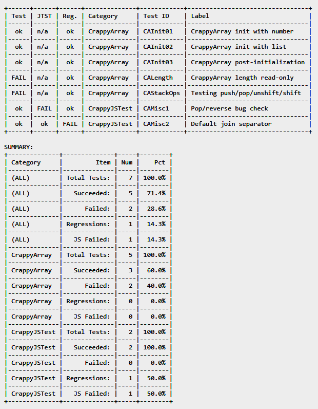
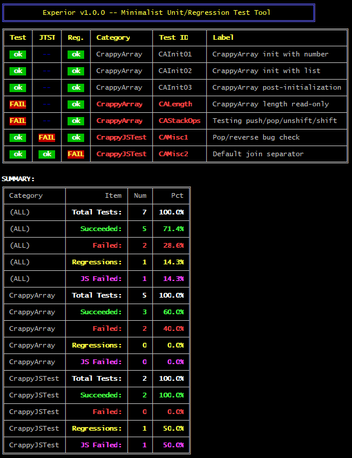

# Experior 1.0.0
**A minimalist but powerful and language-agnostic unit and regression test tool.**

> "Experior" is a Latin verb meaning "to put to the test". It is the root of the English words "experiment", "experience", and "expert".

## Overview

Experior doesn't care what language your test program is written in. All it
cares about is that each test's output begins and ends with a simple line of
JSON. Your test program can validate its own output, in which case Experior just
acts as a report engine. Alternatively -- or additionally -- you can write
validation functions in JavaScript, and Experior will run them against the test
output. Finally, Experior can compare your current test output against a copy of
previous test output and alert you to regressions.

Full details are below, including s demo to serve as an example.

## Installation

If you're not interested in poking around with the source, the easiest thing to do
is to just use `npm` to install the Node.js module:

```bash
$ npm install experior --global
```

## Command-Line Usage

```
===========================================================================
         Experior v1.0.0 -- Minimalist Unit/Regression Test Tool
===========================================================================

  Usage: experior [options]

    -i, --infile        <filename(s)>  Path to input file(s).
    -o, --outfile       <filename(s)>  Output file names.
    -r, --regression    <filename>     Regression test input file.
    -R, --full-regress                 Create and use full regression data.
    -j, --jstest        <filename>     JavaScript test module.
    -c, --css           <filename>     CSS file to use with HTML output.
    -l, --long                         Use long report format.
    -w, --width         <number>       Set width for text descriptions.
    -m, --msgprefix     <string>       Experior message prefix.
    -f, --failures                     Only show failures in reports.
    -v, --verbose                      Increase verbosity (1-4).
    -q, --quiet                        Suppress console output.
    -d, --debug                        Display debugging info.
    -h, --help                         Display this text.
```

When performing tests, there are two mandatory switches, `--infile` and
`--outfile`.

__i, --infile__: Specifies one or more input files containing test data. As with the
other switches that take multiple arguments, you can place arguments after a single instance
of a switch or use the switch multiple times, e.g.

```bash
$ experior -i foo.dat bar.dat         # is equivalent to...
$ experior -i foo.dat -i bar.dat
```

__-o, --outfile__: Specifies one or more output files whose format is determined
by their file extensions. The supported extensions are `.txt`, `.html`, `.csv`,
and `.json`. Additionally, you can use the special names `console` and `ansi` to
send output to the screen. The `console` report is plain text, while the `ansi`
report uses snazzy colors.

__-r, --regression__: Specifies a JSON file generated by a previous known-good
run to compare with the current run to detect regressions.

__-R, --full-regress__: If this flag is provided, the JSON output includes the
contents of the test output to use in generating diffs which are displayed along
with regressions in the HTML version of the reports.

__-j, --jstest__: Specifies the name of a JavaScript module containing tests to
run against the test data. See the _JavaScript Tests_ section below for details.

__-c, --css__: HTML reports have their own inline styles, but if you want to
replace it with your own, use `-c` to provide a URL for an external stylesheet.

__-l, --long__: Activates the long report format which includes detailed test
descriptions.

__-w, --width__: For `.txt`, `console`, and `ansi` formats, sets the width of
the description column. The default is 40 characters.

__-m, --msgprefix__: Sets an alternate message prefix for test metadata. See
the _Test File Format_ section for details.

__-f, --failures__: If used, only failed tests will appear in the reports.

__-v, --verbose__: Increases the verbosity of informational output at the
console. May be used up to four times.

__-q, --quiet__: Turns on quiet mode, suppressing all unnecessary console
output.

__-d, --debug__: Turns on debugging output.

__-d, --help__: Displays the usage summary above.


## Test File Format

Test files consist of test output beginning and ending with specially-marked messages
to Experior. These messages begin with a standard prefix at the beginning of the line. The
default prefix is `@EXPERIOR:`, but you can choose your own with the `--msgprefix` command
line switch. The prefix is followed by a JSON string containing the test parameters.

The message at the beginning of each test looks like this:

```
@EXPERIOR: {"type":"begin","id":"TestOne","cat":"testdata","label":"A 100% successful test","desc":"This is to test total success.","jsTest":"hasNoAlpha"}
```

And yes, it does have to be on one line, but let's look at a more human-readable
version of the JSON data:

```javascript
{
    type: 'begin',
    id: 'TestOne',
    cat: 'testdata',
    label: 'A 100% successful test',
    desc: 'This is to test total success.',
    jsTest: 'hasNoAlpha'
}
```

The `type` attribute can have one of two values, `'begin'` or `'end'`; at the
beginning of a test block, it will obviously be `'begin'`. The `id` attribute
supplies a unique identifier for the test. You can group tests by supplying a
category name in the `cat` attribute. (Report results are sorted by category and
then identifier.) The `label` attribute is a short, human readable title for the
test which appears on all reports. The `desc` attribute can be used for a more
detailed description which only appears on the long version of reports. Finally,
the optional `jsTest` attribute is either a string naming a JavaScript test
function or an array of test function names.

Everything after the `begin` message is test output until the closing `end`
message, which looks like this:

```
@EXPERIOR: {"type":"end","id":"TestOne","success":true }
```

Aside from `type`, which is `end` this time, and `id`, which is a repeat of the
test identifier, the only other attribute is `success`, which contains a boolean
indicating whether the test succeeded or not.

And that's it. If you can get your test program to crank that out, you're ready
to go.

## Output Formats

### .txt/console



### ANSI console

MS-DOS survivors, represent!



### HTML

If you don't care for my dubious web design skills, Experior will let you substitute
your own CSS stylesheet with the `--css` switch.


### CSV

The only thing less interesting than CSV files is anything one could think to say
about them.

```
Test,JTST,Reg.,Category,"Test ID",Label,"Test Description"
ok,ok,ok,testdata,TestFour,"A 100% successful test","This is to test total success."
FAIL,ok,ok,testdata,TestOne,"Some even numbers","This is a bunch of even numbers."
ok,FAIL,ok,testdata,TestThree,"Some negative numbers","This is a bunch of negative numbers."
ok,ok,FAIL,testdata,TestTwo,"Some odd numbers","This is a bunch of odd numbers."

SUMMARY:
"Total Tests:",4,100.0%
Succeeded:,3,75.0%
Failed:,1,25.0%
Regressions:,1,25.0%
"JS Failed:",1,25.0%
```

### JSON

JSON output is produced as a single line. We've dumped it here by passing it through
Node's `console.log` to make it more readable.

```javascript
{ TestOne:
   { id: 'TestOne',
     cat: 'testdata',
     label: 'Some even numbers',
     desc: 'This is a bunch of even numbers.',
     success: false,
     hash: '7dd9d0507fa51a36dd01ccca9b767a44',
     size: 27,
     jsSuccess: true,
     regression: false },
  TestTwo:
   { id: 'TestTwo',
     cat: 'testdata',
     label: 'Some odd numbers',
     desc:
      'This is a bunch of odd numbers.',
     success: true,
     hash: '3a3643bc0e3783a8478f5f0febfd5fde',
     size: 29,
     jsSuccess: true,
     regression: true },
  TestThree:
   { id: 'TestThree',
     cat: 'testdata',
     label: 'Some negative numbers',
     desc: 'This is a bunch of negative numbers.',
     success: true,
     hash: '8aac0526c764d1d27d4ea51c74e5e783',
     size: 120,
     jsSuccess: false,
     regression: false },
  TestFour:
   { id: 'TestFour',
     cat: 'testdata',
     label: 'A 100% successful test',
     desc: 'This is to test total success.',
     success: true,
     hash: '9f62cbf5dad6e929a72071a409aec202',
     size: 30,
     jsSuccess: true } }
```

If the `--full-regress` option is enabled, this will include `testOutput` and,
when a regression is detected, a `diff` element.

## Regression Tests

Regression tests are fundamentally simple. Your tests produce enough output to
thoroughly exercise the code under test, and when you have a successful test,
you use Experior to output a summary as a JSON file and save it for future use.

The JSON test summary contains an MD5 hash of the test output, so when you
re-run your tests to produce a new input file, you can use the `-r` or
`--regression` switch to reload your old test summary. Experior will then
compare the old MD5 hashes to the new ones and flag tests with regressions in
the reports.

If the `--full-regress` switch is used, the full contents of the test data will
be included, enabling the production of diffs in the report.

## JavaScript Tests

Experior expects you to write your own tests however you want. You could be
writing a C++ program to exercise a library written in C. You could be using a
scripting language with one of those
`stupid(frameworks).with(pseudoEnglish).chained(syntax)`. Like the honey badger,
Experior don't care. You do your tests, write the output to a file, and you can
write a bunch of tests in high-level JavaScript to sift through output from an
assembly language program as easily as output from another JavaScript program.

To do this, you write your tests as functions that reside as keys in an object
exported by a Node.js module. Once referenced on the commandline with the
`--jstest` switch, Experior will require your module and apply the tests where
directed by the optional `jsTest` attribute in the beginning-of-test header,
which contains either a single function name or an array of function names.

The functions all take the same arguments:

```javascript
function(cat, testId, data)
```

...where `cat` is the category name from the `cat` attribute in the header,
`testId` is from the `id` attribute, and `data` contains all of the lines from
the actual test data packed together as a string with embedded newlines. The
function does whatever it's going to do and then returns `true` on success or
`false` on failure.

The module file might look like this:

```javascript
var tests = {
	foo: function(cat, testId, data) { /* mumble mumble */ },
	bar: function(cat, testId, data) { /* mumble mumble */ },
	baz: function(cat, testId, data) { /* mumble mumble */ },
}

module.exports = tests;
```

Given the above, you can fire off a single test in the header like this:

```javascript
...,"jsTest":"foo" }
```

Or you can fire off several by supplying an array:

```javascript
...,"jsTest":["foo","bar","baz"] }
```

Failed JavaScript tests are reported separately from both regressions and
the test results stored in the `success` element in the header.

## Usage Example

If you clone the [source repository](https://github.com/Waidthaler/experior),
you'll find the example files in the `/examples` subdirectory. It includes the
obscurely named `test_program.js` which runs a decently wide range of simple
tests on a crappy array implementation, `CrappyArray.js`. An example JavaScript
post-test is provided in `jstests.js`. Finally, there is a set of regression
data in `regression_data.json`. This may be the most superfluous paragraph I've
ever written.

To get started, go to the `/examples` subdirectory and run the test program:

```bash
$ cd examples
$ node test_program.js
```

This will produce an output file called `test_output.txt`. Take some time to
read over `test_program.js` and its comments, and see how it relates to the test
output file.

Now we'll fire up Experior and generate the full set of reports:

```bash
$ experior -i test_output.txt -r regression_data.json -R -j jstests.js -l -o ansi test_report.txt test_report.csv test_report.html test_report.json
```

This will produce a colorful onscreen report (the `ansi` in the list of outputs)
and four output files named `test_report.txt`, `test_report.csv`,
`test_report.json`, and `test_report.html`. Open `test_report.html` in your
browser to see the results.

You'll note that the first test fails and includes a diff with the JSON output
from a hypothetical previous run, `regression_data.json`. This is actually
identical to the `test_report.json` file you just generated, minus some changes
I made to the first test's output to simulate a regression. The `-R` switch is
required if you want the detailed diff. Without it, Experior just stores a hash
of the test data, which is enough to detect regressions if you don't need or
want the diff.


